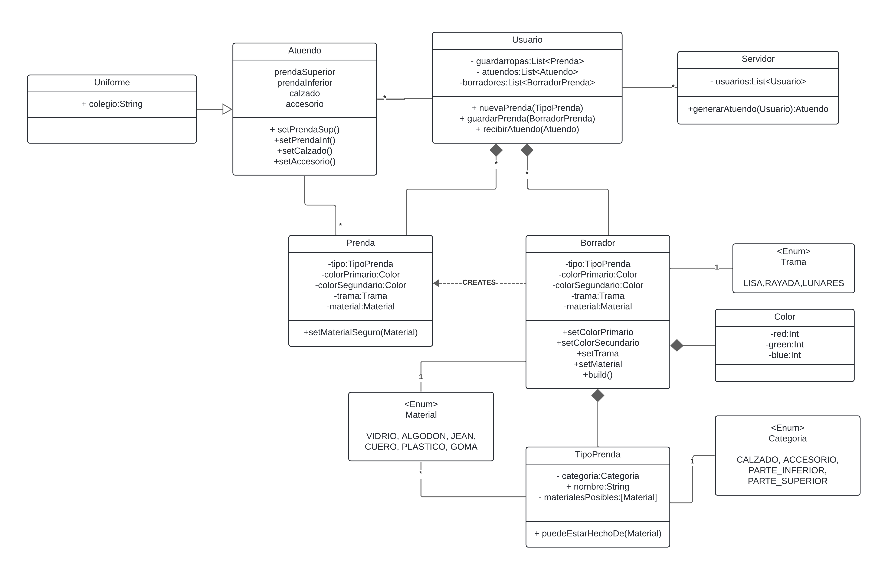

# Qué Me Pongo

Se utilizó la plantilla oficial de proyectos para Java y Maven.
  
Correcciones para la I.2  
- Implementar colores como una clase con atributos RGB, no como enum. Se quiere visualizar colores.  
- Agregar validaciones en constructores porque Constructores admiten NULL.  
- Implementar Categoria como ENUM  
  
Correcciones para la I.3
- El borradorPrenda de la ultima prenda no necesita ser tan estricto, puede haber muchas ultimas prendas.  
- Usar un builder para la prenda y hacer las verificaciones ahi. 
- No hay clase administrador. Estos serian usuarios con acceso a los metodos del servidor.

Nociones para la I.3 (clase 03/05)  

- Podria existir una clase sugerencia con los tipos de prenda que admite.
- Que el usuario tenga la lista de prendas y ademas (de alguna manera) el metodo generarSugerencias porque el input del 
metodo son las prendas guardadas. Devolveria el producto cartesiano entre los 3 conjuntos de prendas.
- guava libreria que permite calcular el producto cartesiano.
- La prenda podria tener un enum de tipo Formalidad (formal-informal-neutro) 
- El metodo generarSugerencias puede estar en distintos "motores" que implementen una clase abstracta MotorSugerencias 
para poder "configurar" la forma de generar sugerencias.
- Ese metodo deberia recibir por parametro solo la edad y no el objeto usuario para generar menor acoplamiento. Asi el motor 
no conoce de usuarios. Solo recibe el primitivo int.
- El mismo motor debe correr para TODOS LOS USUARIOS. Existe nocion de GLOBALIDAD. Deberia implementarse inyeccion de 
dependencias, por ejemplo a traves de un service locator desde el MotorSugerencias al constructor del usuario.

---

La clase Servidor sería la encargada de procesar las solicitudes de los distintos clientes.  
    -Tendrá una lista de clientes verificados para hacer chequeos.   
    -Almacena los uniformes que se generan, haciendo de rol de **administrador**. Estos serian usuarios con acceso al servidor.  

Cada Usuario conoce sus prendas y los atuendos que se le generan.  
    -Por lo pronto, no implementa sensibilidades climaticas ni gustos sobre prendas  
    -Podrian agregarse datos personales que el servidor pueda usar para validar al usuario.

Los uniformes heredan de el Atuendo. "Son un tipo de atuendo".  

Por lo pronto, el atuendo solo tiene un atributo por clase de prenda, pues **no hay superposicion**.

Si se quere testear el proveedor del clima, crear un Mock sobre la interfaz Servicio Meteorologico.

